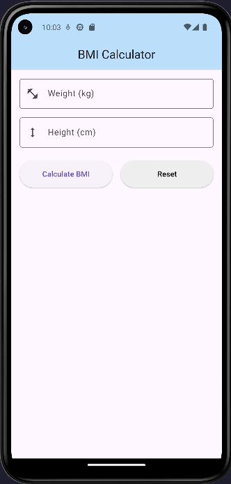
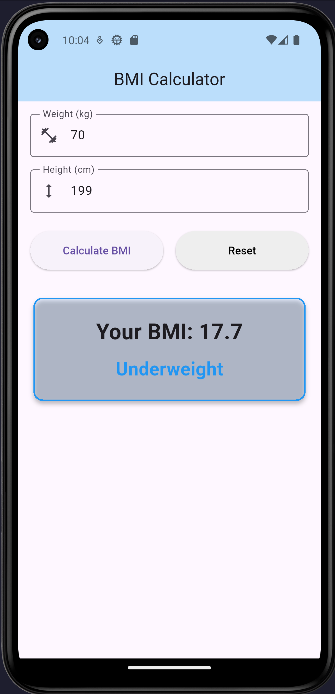
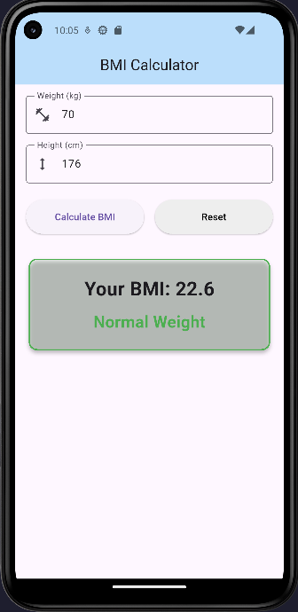
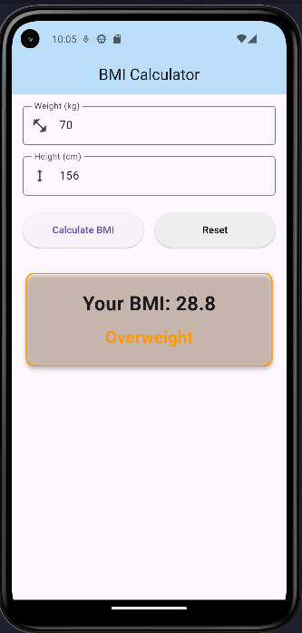
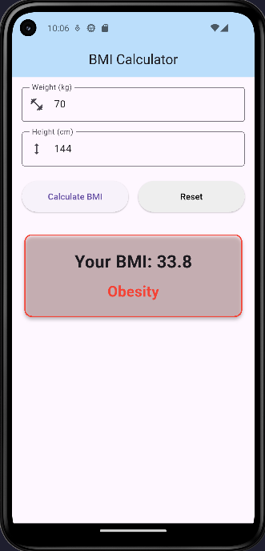

# BMI Calculator App

A simple and elegant Flutter application that calculates Body Mass Index (BMI) based on user input (Weight and Height) and provides a visual indication of the user's BMI category.

## Features
- **Accurate Calculation**: Calculates BMI using the formula: `BMI = Weight (kg) / Height² (m)`.
- **Real-time Feedback**: Displays BMI category immediately after calculation.
- **Color-coded Results**: Visual indication based on categories:
  - 🔵 **Underweight**: < 18.5
  - 🟢 **Normal Weight**: 18.5 – 24.9
  - 🟠 **Overweight**: 25.0 – 29.9
  - 🔴 **Obesity**: ≥ 30.0
- **Validation**: Ensures weight and height are valid positive numbers.
- **Reset Option**: Clear all inputs and results with a single tap.
- **Clean UI**: Built with Flutter Material 3.

## Screenshots

| 01. Homepage | 02. Underweight | 03. Normal Weight |
| :---: | :---: | :---: |
|  |  |  |

| 04. Overweight | 05. Obesity |
| :---: | :---: |
|  |  |

## Installation

1.  **Clone the repository**:
    ```bash
    git clone https://github.com/Mdyeasinkhan4/bmi_calculator_app.git
    ```
2.  **Navigate to the project directory**:
    ```bash
    cd bmi_calculator_app
    ```
3.  **Get dependencies**:
    ```bash
    flutter pub get
    ```
4.  **Run the app**:
    ```bash
    flutter run
    ```

## Technologies Used
- **Flutter**: UI Toolkit for building natively compiled applications.
- **Dart**: Programming language optimized for UI.

---
Developed by [Md Yeasin Khan](https://github.com/Mdyeasinkhan4)
